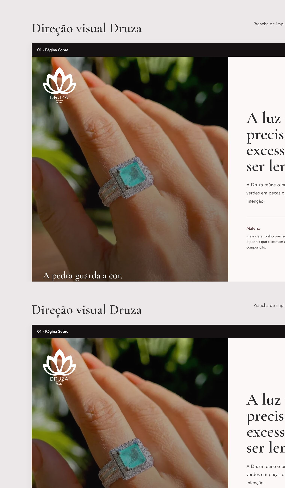
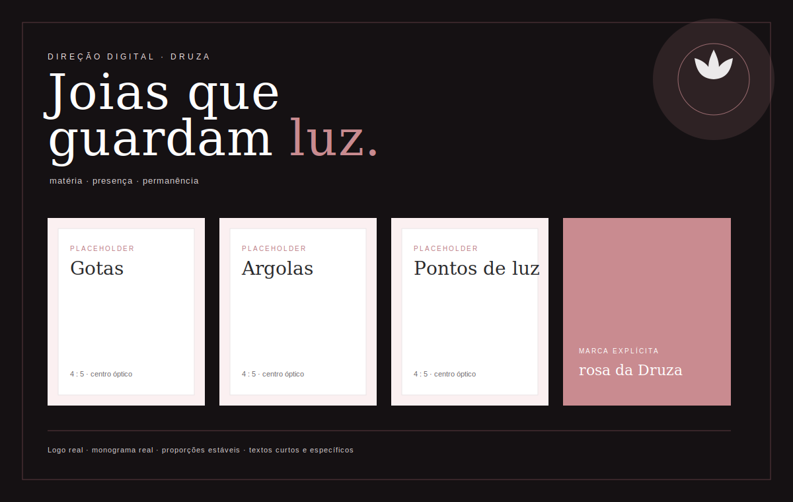

# Druza: Sobre, presença social e lista de espera de brincos

Data: 2026-07-16
Status: revisado para aprovação

## Objetivo

Fortalecer a percepção de marca da Druza em três pontos: aprofundar a página Sobre,
criar uma presença social autêntica na home e transformar a página de brincos em uma
prévia editorial com lista de espera via WhatsApp.

O resultado deve ser sofisticado, honesto e coerente com a identidade já existente.
Nenhum depoimento, número, preço, produto disponível ou história institucional será
inventado.

## Direção aprovada

A direção escolhida é "Lançamento editorial". A coleção de brincos será apresentada por
três famílias conceituais: Gotas, Argolas e Pontos de luz. Cada família usa o placeholder
premium existente até que a marca possua fotografias reais.

Toda a interface reutiliza os ativos e o sistema visual atuais da Druza:

- logo e monograma oficiais;
- Cormorant Garamond e Jost;
- base branca com rosa de assinatura;
- tokens, botões, placeholders `.ph`, espaçamento e movimento já definidos;
- foco visível, contraste e redução de movimento existentes.

## Prancha visual de implementação

A prancha acima não é uma referência genérica. Ela foi composta com os ativos reais
`img/druza-logo-white.png`, `img/druza-mark-white.png` e `img/anel-paraiba.webp`, além das
fontes e cores já adotadas pelo site. A implementação deve reproduzir sua hierarquia,
proporções e alinhamentos, adaptando a composição para cada largura de tela.

Esta segunda prancha documenta a grade técnica: três áreas de placeholder com proporção
estável, centro óptico comum, legenda legível e uma aplicação explícita do logo branco.

## Textos finais aprovados

Todo texto abaixo é conteúdo final. A implementação não usará lorem ipsum, rótulos como
"texto de exemplo" nem frases vagas que poderiam pertencer a qualquer loja.

### Sobre

Título:

> A luz não precisa de excesso para ser lembrada.

Manifesto:

> A Druza reúne o brilho frio da prata e a presença das pedras verdes em peças que
> acompanham o cotidiano sem perder intenção. A pedra guarda a cor. A prata devolve a
> luz. Entre as duas, existe um detalhe que não precisa disputar espaço para ser notado.

Princípios:

- **Matéria:** Prata clara, brilho preciso e pedras que sustentam a composição.
- **Presença:** Detalhes que aparecem sem disputar espaço com quem os usa.
- **Permanência:** Formas delicadas para atravessar ocasiões e combinações.

Chamada final:

> Conheça as peças que já fazem parte da Druza e acompanhe os próximos gestos da marca.

### Faixa social da home

Título:

> A Druza acontece também entre um detalhe e outro.

Texto:

> No @druzaoficial, você acompanha novas peças, escolhas de pedras e os próximos
> lançamentos.

CTA: `Ver @druzaoficial`.

### Brincos

Abertura:

> Brincos que iluminam o rosto.

Introdução:

> A coleção está sendo preparada em três gestos. Enquanto as fotografias não chegam,
> cada família recebe uma arte Druza identificável, sem sugerir um produto já disponível.

Famílias:

- **Gotas:** Pedras próximas ao rosto, com movimento contido e presença de cor.
- **Argolas:** Um contorno de prata pensado para acompanhar o ritmo de todos os dias.
- **Pontos de luz:** Escala mínima, brilho preciso e uma pedra verde como ponto de atenção.

Lista de espera:

> Seja avisada quando os brincos chegarem.

Texto de apoio:

> A conversa abre com a mensagem da lista de espera já preenchida.

## Página Sobre

A página `sobre.html` passará de texto provisório para uma composição editorial completa,
sem afirmar fatos históricos ainda não fornecidos pela marca.

Conteúdo:

- abertura com a assinatura "Joias que guardam luz";
- manifesto sobre prata, pedras verdes, presença, leveza e elegância sem excesso;
- índice editorial curto para organizar a leitura;
- três princípios da marca: matéria, presença e permanência;
- chamada final para conhecer a coleção e acompanhar a Druza no Instagram.

Não serão citados fundadora, data de criação, fabricação própria, origem de materiais ou
processos que não estejam documentados.

### Arte e posicionamento da marca

- O primeiro quadro combina uma fotografia real de produto com o logo branco completo.
- O logo deve permanecer inteiro, sem recorte, com largura entre `104px` e `132px` no
  desktop e entre `82px` e `104px` no mobile.
- O logo fica no quadrante superior esquerdo da fotografia, sempre com área de respiro de
  no mínimo metade de sua largura.
- A fotografia recebe apenas uma camada escura suficiente para garantir contraste; não
  será desfocada nem escondida por efeitos decorativos.
- O manifesto ocupa uma coluna própria. Texto nunca será sobreposto a partes importantes
  da joia ou comprimido dentro de um cartão.

## Presença social na home

A home receberá uma faixa compacta e editorial vinculada ao perfil real
`https://www.instagram.com/druzaoficial/`.

A faixa:

- usará o texto "Acompanhe a Druza" e o identificador `@druzaoficial`;
- convidará a acompanhar bastidores e lançamentos;
- não exibirá avaliações, seguidores, curtidas, métricas ou imagens simuladas;
- abrirá o perfil em nova aba com `noopener noreferrer`;
- respeitará o ritmo e a identidade visual já presentes em `index.html`.

O monograma branco aparecerá dentro do círculo rosa da marca, com tamanho óptico mínimo
de `48px`. O título, o texto e o CTA formarão uma única linha editorial no desktop e uma
pilha ordenada no mobile. O logo não será usado como marca d'água atrás do texto.

## Página de brincos

`brincos.html` deixará de apresentar produtos, preços e parcelamentos fictícios. A página
será uma prévia de lançamento com:

- hero editorial "Brincos que iluminam o rosto";
- estado claro "Coleção em preparação";
- famílias Gotas, Argolas e Pontos de luz;
- placeholder `.ph` em cada família, sem fotografia improvisada;
- texto curto explicando o papel de cada estilo;
- chamada para acompanhar o processo no Instagram;
- botão principal para entrar na lista de espera pelo WhatsApp.

Os nomes das famílias descrevem categorias editoriais, não produtos disponíveis para
compra.

### Artes e alinhamento dos placeholders

Cada família terá uma arte própria construída com o monograma oficial, o rosa de assinatura
e uma legenda específica. As três artes usarão a mesma estrutura para evitar desalinhamento:

- proporção fixa `4 / 5`;
- três colunas de largura idêntica no desktop;
- `align-items: stretch` no grid e áreas de texto com a mesma altura mínima;
- títulos, descrições e estados alinhados pela mesma linha de base;
- espaço interno de `22px` a `28px`, reduzido proporcionalmente no mobile;
- uma coluna no mobile, mantendo a proporção das artes e a ordem Gotas, Argolas e Pontos de luz;
- nenhuma imagem ausente, caixa vazia, preço, parcela ou botão de compra.

As legendas das artes serão específicas: `Retrato da família Gotas em produção`,
`Retrato da família Argolas em produção` e `Retrato da família Pontos de luz em produção`.

## Tipografia e legibilidade

- Cormorant Garamond será usada apenas em títulos e frases editoriais.
- Jost será usada em corpo, navegação, CTA, legendas e estados.
- Corpo de texto: mínimo `16px` no desktop e no mobile, com `line-height` entre `1.55` e `1.72`.
- Legendas operacionais: mínimo `13px`; nunca serão o único meio de transmitir uma informação essencial.
- Títulos usarão `text-wrap: balance`; parágrafos usarão `text-wrap: pretty` quando suportado.
- Linhas de leitura terão no máximo `65ch`.
- Os novos componentes não usarão espaçamento negativo entre letras nem caixa alta extensa.
- O texto não ficará sobre fotografia sem contraste mínimo de `4.5:1`.
- Nenhuma escala tipográfica dependerá diretamente da largura da viewport.

## Integração com WhatsApp

O número de atendimento é `+55 11 96607-4268` e o destino técnico é
`https://wa.me/5511966074268`.

O botão da lista de espera usará a mensagem codificada:

> Olá, Druza! Quero entrar na lista de espera dos brincos e receber novidades da coleção.

O fluxo será um link comum, sem dependência de JavaScript, formulário ou banco de dados.
Em dispositivos com WhatsApp instalado, o aplicativo poderá ser aberto; nos demais, o
WhatsApp Web será usado. O envio só acontece quando a pessoa confirma a mensagem no
WhatsApp.

## Arquivos e limites

Arquivos previstos:

- `sobre.html`;
- `index.html`;
- `brincos.html`;
- `css/styles.css`;
- `docs/superpowers/specs/2026-07-16-druza-digital-art-direction.svg`;
- documentação de design, apenas se a implementação introduzir um padrão reutilizável
  que ainda não esteja registrado.

Não fazem parte deste trabalho:

- banco de avaliações;
- integração com a API do Instagram;
- captura de telefone ou cadastro no site;
- painel para administrar a lista de espera;
- criação de fotografias ou produtos fictícios;
- refatoração geral do cabeçalho ou do restante do e-commerce.

## Acessibilidade e comportamento

- links e botões terão rótulos claros e foco visível;
- links externos usarão `target="_blank"` e `rel="noopener noreferrer"` quando abrirem nova aba;
- placeholders terão descrições acessíveis e não serão anunciados como fotos reais;
- textos manterão contraste WCAG 2.1 AA;
- layouts serão testados em larguras mobile e desktop;
- animações respeitarão `prefers-reduced-motion`;
- o conteúdo e os links principais funcionarão sem JavaScript.

## Verificação

A implementação será considerada pronta quando:

1. a página Sobre não contiver aviso de texto provisório nem afirmações não documentadas;
2. a home apontar para `@druzaoficial` sem números ou avaliações inventadas;
3. a página de brincos não mostrar preços, parcelamentos ou disponibilidade fictícios;
4. os três placeholders editoriais usarem os estilos e ativos existentes;
5. logos, fontes e textos forem visíveis, legíveis e corretamente posicionados;
6. não houver texto genérico, sobra de copy provisória ou elemento desalinhado;
7. o CTA abrir `wa.me/5511966074268` com a mensagem aprovada;
8. os fluxos forem navegáveis por teclado e legíveis em mobile e desktop;
9. as páginas não apresentarem erros de console ou links internos quebrados nos fluxos alterados.
